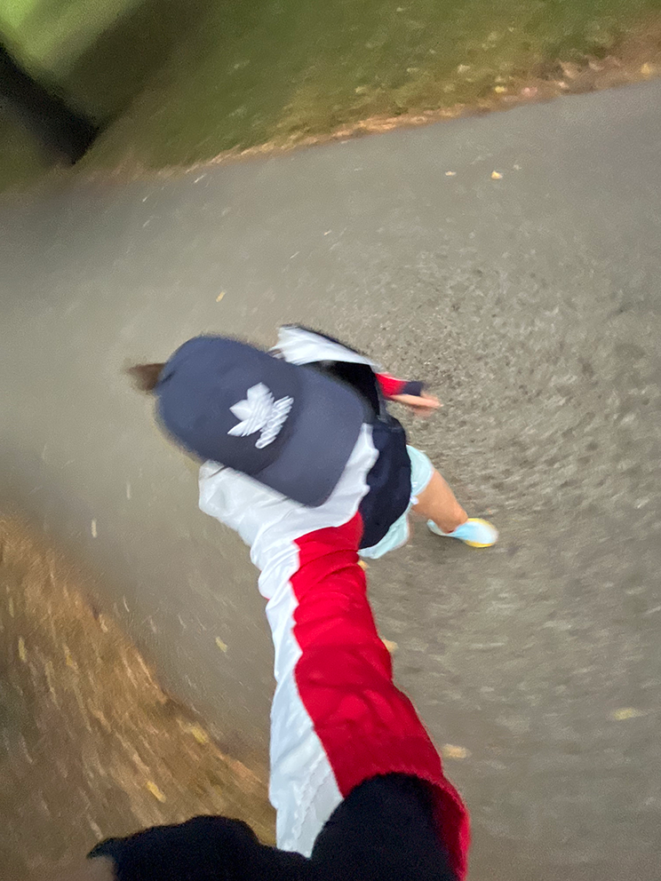
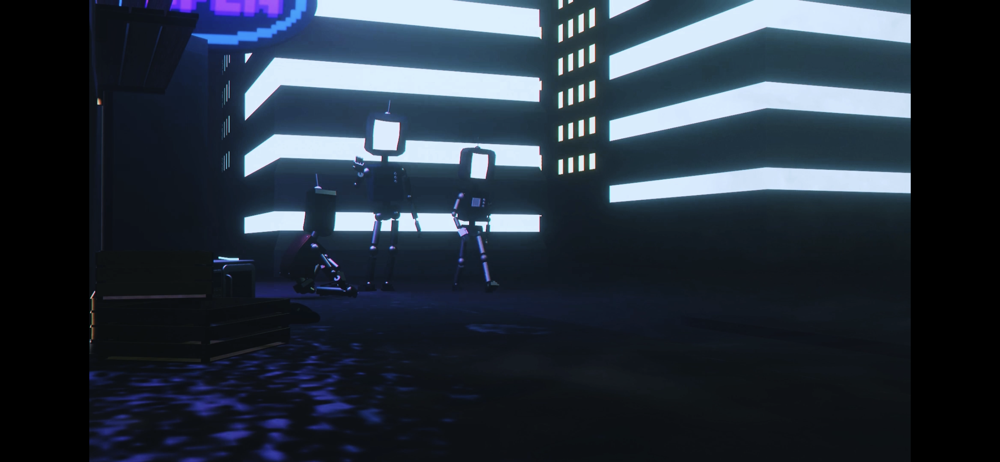

# First Impression

## About

Hi, i'm Sofia.
Unlike others i don't really know who i am. I don't have any cool work expirience, my only projects are the school ones or my personal ones.
I studied at a french school, a hell on earth, haha. I do speak 5 laguages, but at cost of my sanity, haha. Anyways.

People will tell me i shouldn't underestimate myself, but call me arogant for being proud of myself. They tell me to plan my future, but call my dreams "ridiculous".
So It's hard to describe who i am at the moment as i am so many things and nobody at all, but i'm going to tell you what i aspire to be. I aspire to be a 3D artist, an illustrator, an athlete.

I love sports, i'm in a track team, i run long disatnces and i do sprints. I used to do horse riding, and i loved it but had to give it up. 

I love animals, i have a few. I have a horse, few cats, two dogs, two bunnies. - love them more than anything.

I love to draw... my love for digital art stated with my old iPad when I DIY’d myself a pan to draw, and spent most of my time scratching the hell out of my iPad’s display. My poor Ipad, RIP. 
I do 3D art. Because anything is possible... in the 3D world. I actually studiet IT for half a year. Hated it. I couldn't pass a single exam, exept english. haha
So i droped out. Few years later here i am, making questionable 3D models. 

- [One Word](https://www.canva.com/design/DAFzNSMShEY/HtndGKof9UMl3immaD3sIw/view?utm_content=DAFzNSMShEY&utm_campaign=designshare&utm_medium=link&utm_source=editor)

“anything and everything, all of the time” 

### My projects 

here is some of my photography. I sometimes do photos for a rescue shelter to help rehome animals. I always loved to take photos and always dreamed of having a camera, and now that i have acces to good camera, i don't really have the time, funny huh? I love helping animals, in one way or the other, so this is one of them. 

Here is a snaphot from my short movie. It's about robots that try to safe our planet after all humans are gone. 

